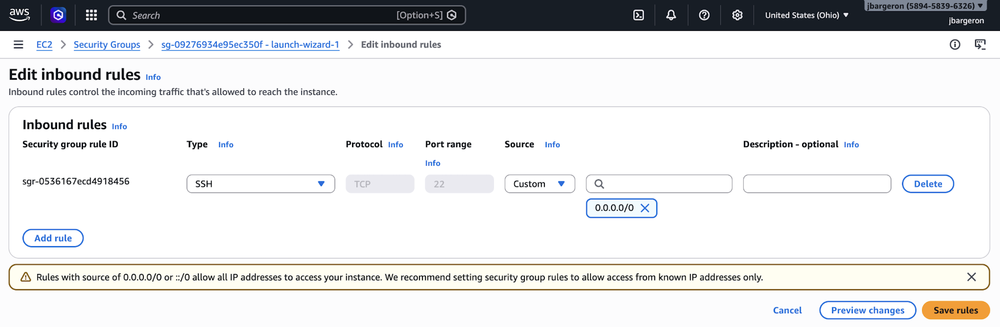
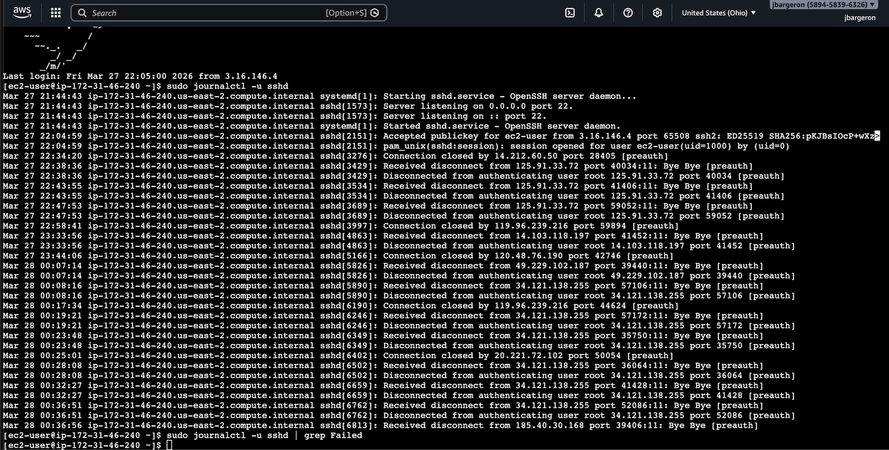
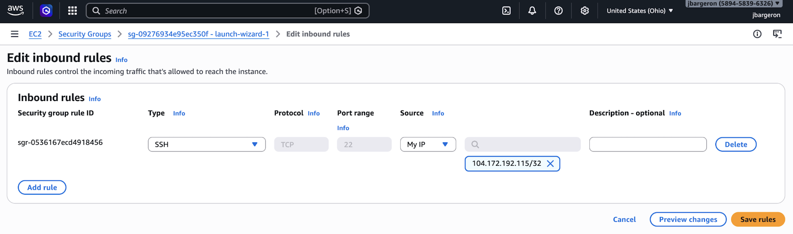
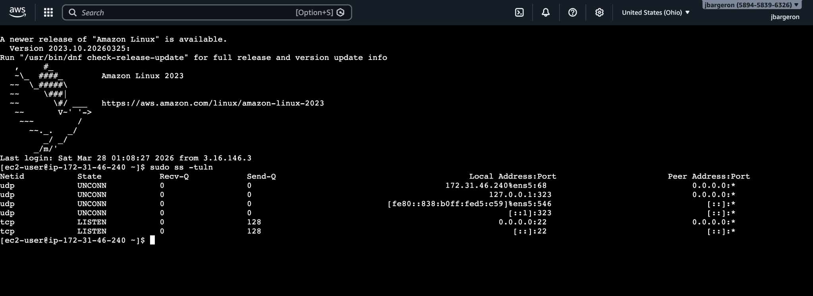

# 🚨 AWS EC2 SSH Attack Simulation & Hardening

## 📌 Overview
This project simulates exposing an AWS EC2 instance to the public internet via SSH and observing real-world attack traffic. After capturing attacker behavior, the instance is hardened by restricting access and improving security configurations.

---

## 🎯 Objectives
- Understand risks of exposing SSH (port 22) to the internet  
- Observe real-world unauthorized access attempts  
- Analyze SSH logs and connection behavior  
- Implement security best practices to mitigate attacks  

---

## 🛠️ Environment
- AWS EC2 (Amazon Linux 2023)
- Instance type: t3.micro
- OpenSSH Server
- AWS Security Groups

---

## ⚠️ Phase 1: Attack Simulation (Insecure Configuration)

### 🔓 Configuration
SSH (Port 22) opened to:
0.0.0.0/0

### 📸 Evidence

---

### 📊 Observed Attack Traffic

After leaving the instance exposed, multiple unauthorized connection attempts were recorded from various external IP addresses.

### 🔍 Key Observations
- Repeated connection attempts from multiple IPs  
- Automated scanning behavior (bots)  
- Attempts targeting default users (e.g., root)  
- Rapid connection/disconnection patterns  

---

## 🛡️ Phase 2: Hardening (Secure Configuration)

### 🔒 Security Changes
- Restricted SSH access to:
<My Public IP>/32

- Removed global access (`0.0.0.0/0`)

### 📸 Evidence

---

## 🔍 Verification

Confirmed SSH service status and active listening ports:
sudo systemctl status sshd
sudo ss -tuln

---

## ✅ Results
- Successfully simulated real-world SSH exposure  
- Captured and analyzed attack traffic  
- Demonstrated how quickly public services are targeted  
- Secured the instance by restricting access  

---

## 🚀 Key Takeaways
- Exposing SSH to the internet is extremely risky  
- Automated bots constantly scan for open ports  
- Security groups are critical for access control  
- Principle of least privilege should always be applied  
